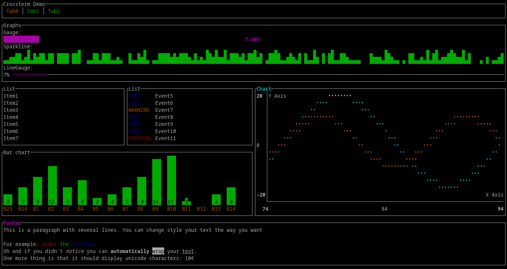
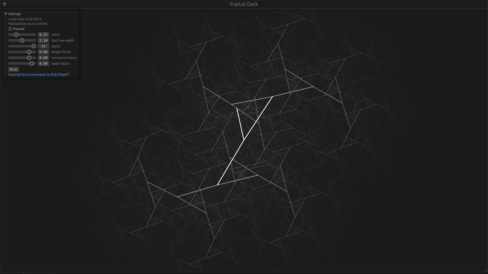
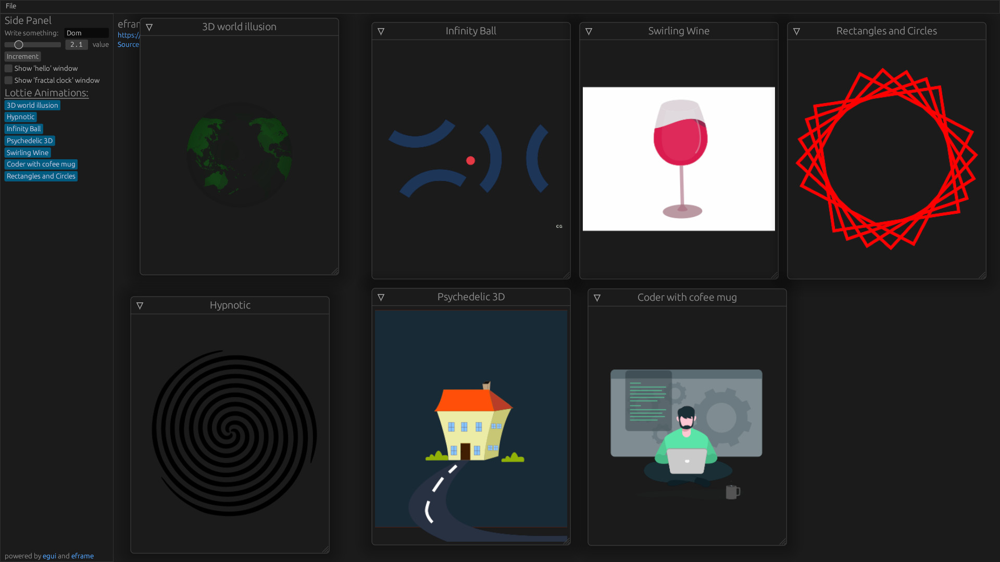
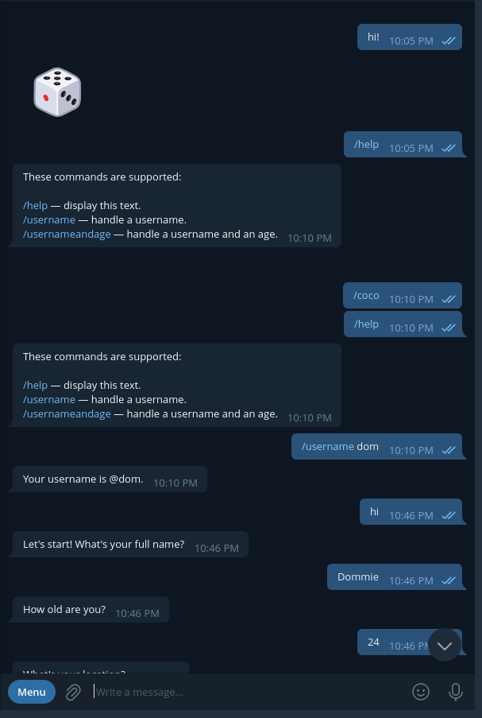
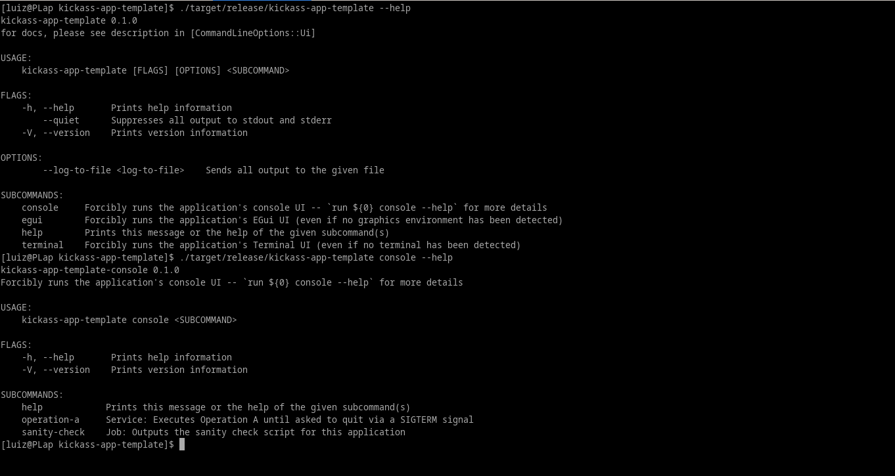
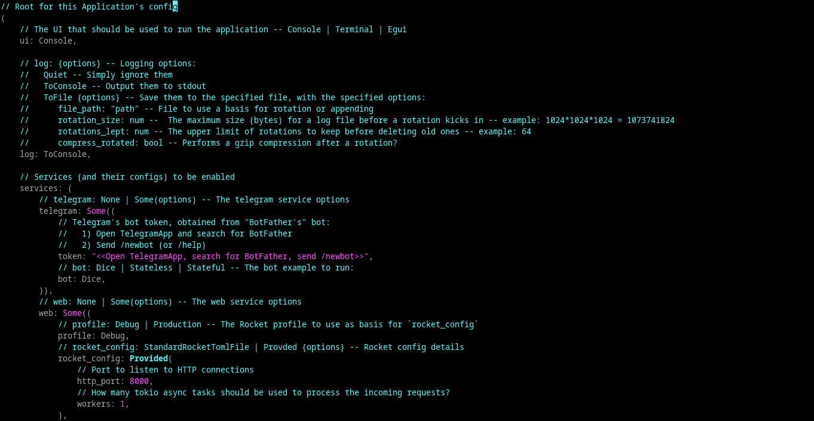

# Production-ready seed & template for Rust Backend & Long Runner Applications

This repository presents a seed for creating backend Rust applications -- with bundled libs, UIs, services & design patterns.

Most likely you'll need only a subset of the features provided by this template:
   1. Services:
      - [X] Web, through `Rocket`
         - [X] embedded static & pre-compressed files -- including an Angular app -- for blazing fast speeds
      - [X] Telegram, through `Teloxide` -- stateless & stateful examples
         - [ ] application initiated message sending
         - [ ] messaging framework inspired on InstantVAS' Microservice pattern
      - [X] Hooks for your own Service
         - [X] async with `Tokio`
   2. UIs:
      - [X] Console -- logging through `slog` with stdout and file sink options
      - [X] Terminal --  `tui` + `crossterm`;
      - [X] GUI -- `egui`
         - [X] `lottie` animations with `rlottie`
         - [ ] charts with `plotters`
      - [X] Integrated & embedded Angular application
         - [X] Angular Universal, automatically pre-rendering parameter-less routes
         - [X] Google Material theming & components
         - [X] Example app to test the web services provided in `src/frontend/web/api`, with flexible components
         - [X] Loading speeds of ~50ms, enabling it to be used as landing pages
   3. Configs:
      - [X] Application-wide `config pattern` tying all features together + customizable to include your business logic
      - [X] Command Line parsing through `structopt`, merging with the application-wide configs
      - [X] Persistent config file using `ron` -- easily serializing any Rust type + automated DOCs generation

# How to use it

   * Click `Use this template`, at the top right of this github page;
   * Edit `Cargo.toml` and clean it up from the dependencies you don't need + associated code, then, failing to compile;
   * Remodel `src/config` & `src/command_line` modules to your needs
   * Add all modules for your business logic
   * Inspect & adjust the `src/frontend` module & submodules
   * Share back (through a PR) any improvements you do to the template

# Screenshots

## Angular

(only 44ms needed to show the content -- 13ms to load index.html + 31ms to render it. After being presented, Angular is loaded and after 664ms we have a fully working website)

## Terminal

## EGui

## Telegram

## Command-Line options example

## Config .ron example

