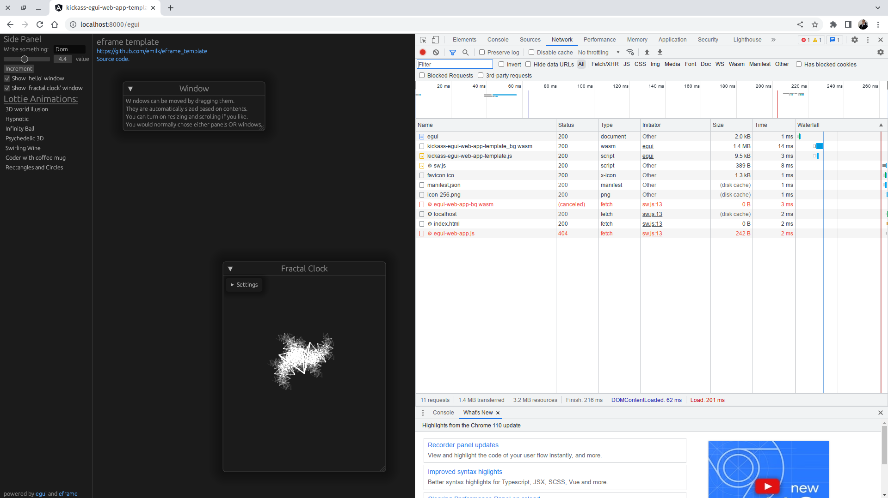

# Production-ready seed & template for Rust Backend & Long Runner Applications

This repository presents a seed for creating backend Rust applications -- with preset libs, UIs, services & design patterns.

Most likely you'll need only a subset of the features provided by this template:
   1. Additional Runtimes:
      - [X] Tokio
      - [ ] Ogre-Workers, for event-driven / iterator-driven / stream-based programming
   2. Services:
      - [X] Web, through `Rocket`
         - [X] Angular UI app -- demo featuring the backend services API exploration (more details bellow)
         - [X] Angular backend app -- exposing metrics, logs, statistics. The demo exposes Tokio data and you may add your own
         - [X] embedded static & pre-compressed files -- including all Angular apps -- for blazing fast speeds
      - [X] Telegram, through `Teloxide`
         - [X] stateless & stateful bot examples (with navigation)
         - [X] application initiated message sending
         - [ ] messaging framework inspired on InstantVAS' Microservice pattern
      - [X] Socket Server, with async Streams & Reactive pipelines
         - [X] Textual protocols (like FIX)
         - [ ] Binary protocols
      - [X] Hooks for your own Service
         - [X] async with `Tokio`
   3. UIs:
      - [X] Console -- logging through `slog` with stdout and file sink options
      - [X] Terminal --  `tui` + `crossterm`;
      - [X] GUI -- `egui`
         - [X] on the native computer's UI and also on Web Assembly, sharing the same code
         - [X] `lottie` animations with `rlottie` (even on web?)
         - [ ] charts with `plotters`
      - [X] Integrated & embedded Angular UI application
         - [X] Angular Universal, automatically pre-rendering parameter-less routes
         - [X] Google Material theming & components
         - [X] Example app to test the web services provided in `src/frontend/web/api`, with flexible components
         - [X] Loading speeds of ~50ms, enabling it to be used as landing pages
      - [ ] Dashboard (using `coreui-free-angular-admin-template` -- Angular), containing:
         - [X] Runtime metrics & stats
   4. Configs:
      - [X] Application-wide `config pattern`, tying all features together + customizable to include your business logic
      - [X] Command Line parsing through `structopt`, merging with the application-wide configs
      - [X] Persistent config file using `ron` -- easily serializing any Rust type + automated DOCs generation
   5. Injection / Runtime Repository:
      - [X] Application-wide `runtime pattern`, sharing runtime data to tie all features together + customizable to include your business logic
      - [X] May be used as an `Injection Repository`
   6. Testing:
      - [X] Built-in example for Big-O analysis with `big-o-test` crate
      - [X] Built-in example for Criterion bench

# Running the default version

Tested in this environment:
   * Rust 1.67
   * Node 19.7.0 (18.9.0 & 18.10.0 are known to mess up with Angular Universal -- more details in the link at the end)

   1) Init the submodule for the `web-stats` app:
       ```git submodule update --init --remote```
   2) Build the angular web apps (you should have `Angular` & `Node` previously setup). Note that if any of those commands fail, building the app in Release mode won't be possible:
       ```cd web-app/; npm i; npm run prerender; cd ..```
       ```cd web-stats/; npm i; npm run build; cd ..```
   3) Build the web-egui app (you should have `Trunk` previously setup):
       ```cd web-egui/; ~/.cargo/bin/trunk build --release; cd ..```
   4) Build the Rust app (release, optimized for the local processor):
       ```RUSTFLAGS="-C target-cpu=native" cargo build --release```
   5) Inspect the command line options (with `--help`) to pick up which UI to run. Bellow, how to run the standard console / daemon mode:
       ```./target/release/kickass-app-template console daemon```

# How to use it

   * Click `Use this template`, at the top right of this GitHub page
   * Edit `build.rs` and remove the web apps you don't want, removing their directories as well
   * Edit `Cargo.toml` and clean it up from the dependencies you don't need + associated code, then, failing to compile
   * Remodel `src/config` & `src/command_line` modules to your needs -- then go ahead and do it for `src/runtime` as well
   * Add all modules for your business logic
   * Elect parts of your code for Big O analysis tests and update `tests/big-o-tests.rs` -- then do the same for Criterion in `bench/`
   * Inspect & adjust the `src/frontend` module & submodules
   * Share back (through a PR) any improvements you do to the template


# Screenshots

## Angular


(only 44ms needed to show the content -- 13ms to load index.html + 31ms to render it. After being presented, Angular is loaded and after 664ms we have a fully working website)

## EGui (web + mobile)

(the same code is shared between the native and web versions of the egui interface)

## Stats


## Terminal


## EGui (native)


(the same code is shared between the native and web versions of the egui interface)

## Telegram


## Command-Line options example


## Config .ron example


# Notes on Angular upgrades for web-app
   * https://update.angular.io
   * (remember to add Universal, like this `ng update @angular/core@14 @angular/cli@14 @nguniversal/express-engine@14`)
   * 2022-10-07: bug on 18.9 Node versions: https://pullanswer.com/questions/prerendering-fails-on-node-js-18-9-but-succeeds-on-node-18-8
